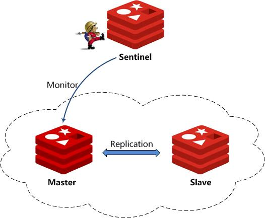

#基础环境
---

### 逻辑架构

构建Redis Sentinel集群环境，最少需要3台服务器环境。架构示意如下：



**Sentinel：** 作为集群监控，主要监控M-S环境，负责Failover后的主从切换处理；

**Master：** 主Server, 作为实际对外提供服务的主机实例；

**Slave： **从Server，作为Master的实时备份，供failover时接管。

### 环境分配

|名称	        |IP地址	        |服务端口	|备注            |
| --            | --            | --        | --             |
|uchatMaster	|172.18.63.74	|6379	    |主实例Master    |
|uchatSlave	    |172.18.63.75	|6379	    |从实例Slave     |
|uchatSentinel	|172.18.63.110	|26379	    |监控服务Sentinel|


### 产品安装

版本号：**<font color=red>2.8.19</font> **(最新稳定版)

产品的安装非常简单，官方步骤如下：

```sh
$ wget http://download.redis.io/releases/redis-2.8.19.tar.gz
$ tar xzf redis-2.8.19.tar.gz
$ cd redis-2.8.19
$ make
$ make test
```

生产上需单独取下介质，略去第一步，在3台服务器上分别安装即可。
