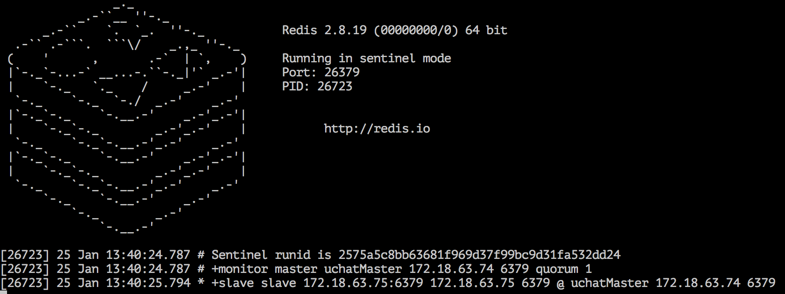

# 启动运行环境
-----------------

配置完Master实例，Slave实例，Sentinel监控服务之后，就可以进行启动运行了。

顺序操作步骤如下：

* 启动uchatMaster实例
* 启动uchatSlave实例
* 启动uchatSentinel实例

---

### 1. 启动uchatMaster实例

进入uchatMaster主机，运行如下启动命令：

```sh
$cd ~/redis-2.8.19/src
$./redis-server ../uchatMaster.conf
```
如果使实例服务在后台运行，有2种方法：

执行命令 ***or*** 修改 uchatMaster.conf 文件中的 daemonize开关

```sh
   $./redis-server ../uchatMaster.conf &
   #或修改配置文件，直接执行即可。
   daemonize yes
```

### 2. 启动uchatSlave实例

进入uchatSlave主机，运行如下启动命令：

```sh
$cd ~/redis-2.8.19/src
$./redis-server ../uchatSlave.conf &
```

### 3. 启动uchatSentinel实例

进入uchatSlave主机，运行如下启动命令：

```sh
$cd ~/redis-2.8.19/src
$./redis-sentinel ../uchatSentinel.conf --sentinel &
```

### 4.查看集群运行状态

#### uchatMaster, uchatSlave 分别启动

在uchatMaster主机日志可以看出,当uchatSlave启动后，会自动备份数据，并同步给uchatSlave实例。


在uchatSlave主机上，可以看出已自动挂载到uchatMaster上，并完成了数据同步。这里要注意下，因为在配置中指定uchatSlave为只读模式，故客户端不能直接对uchatSlave进行写操作。


#### uchatSentinel 启动监控服务

在uchatSentinel主机上，可以看出sentinel已监控接管了uchatMaster和uchatSlave。


