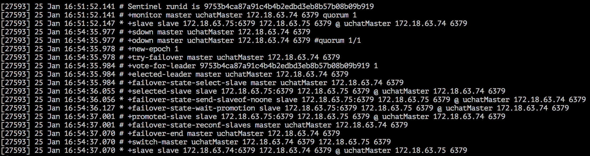

# Master故障及恢复
---

验证uchatMaster宕机后，uchatSlave是否可接管。

### uchatMaster宕机

#### 停止uchatMaster服务

在集群的任意主机上，执行停实例命令，或直接kill进程。

```sh
$./redis-cli -h 172.18.63.74 -p 6379 shutdown
```

此时uchatMaster实例停止，因为Sentinel中配置Master主机failover 3 分钟后开始接管，此时查看uchatSentinel日志：



可以看出，3分钟后sentinel监控到uchatMaster服务停止，此时自动将uchatSlave(172.18.63.75)切换成uchatMaster.

#### 查看集群状态

通过命令再次确认集群信息：
```sh
./redis-cli -h 172.18.63.110 -p 26379 info sentinel
```
查看redis的主从信息，发现原uchatSlave (172.18.63.75) 已升级为Master：
```sh
# Sentinel
sentinel_masters:1
sentinel_tilt:0
sentinel_running_scripts:0
sentinel_scripts_queue_length:0
master0:name=uchatMaster,status=ok,address=172.18.63.75:6379,slaves=1,sentinels=1
```

#### 查看uchatSlave状态

查看uchatSlave.conf 配置文件，<font color=red>实例已经删除 “slaveof 172.18.63.74 6379” 配置行参数</font>。

再次查看uchatSlave状态：
```sh
$./redis-cli -h 172.18.63.75 -p 6379 info replication
```

此时uchatSlave的role已变成master：

```sh
# Replication
role:master
connected_slaves:0
master_repl_offset:0
repl_backlog_active:0
repl_backlog_size:1048576
repl_backlog_first_byte_offset:0
repl_backlog_histlen:0
```

uchatSlave已转换成Master，完成对集群的接管，实例可写，并对外提供服务。

### uchatMaster再恢复

#### 再次启动uchatMaster

当恢复已关闭的uchatMaster服务，会发现uchatMaster(172.18.63.74)重新加入到集群中，但是它已不再是主Master，变成了从Slave。


由上可见，当主Master发生故障后，在Sentinel场景下可实现自动接管。
